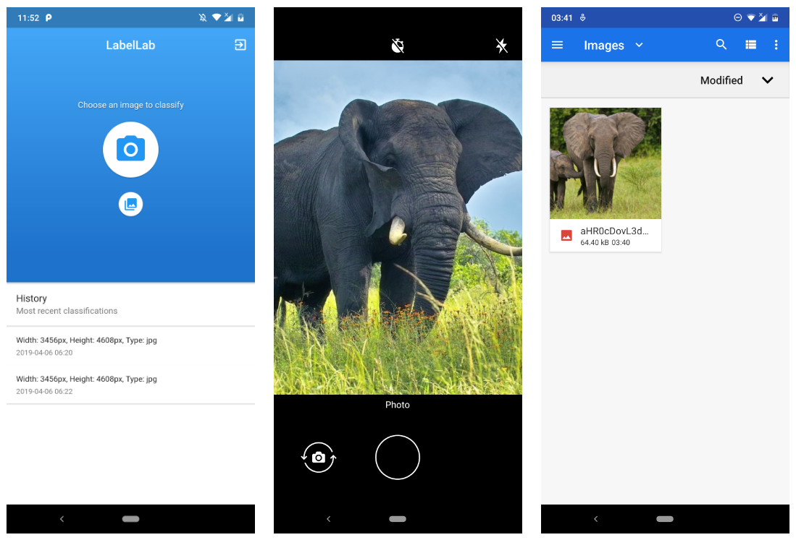
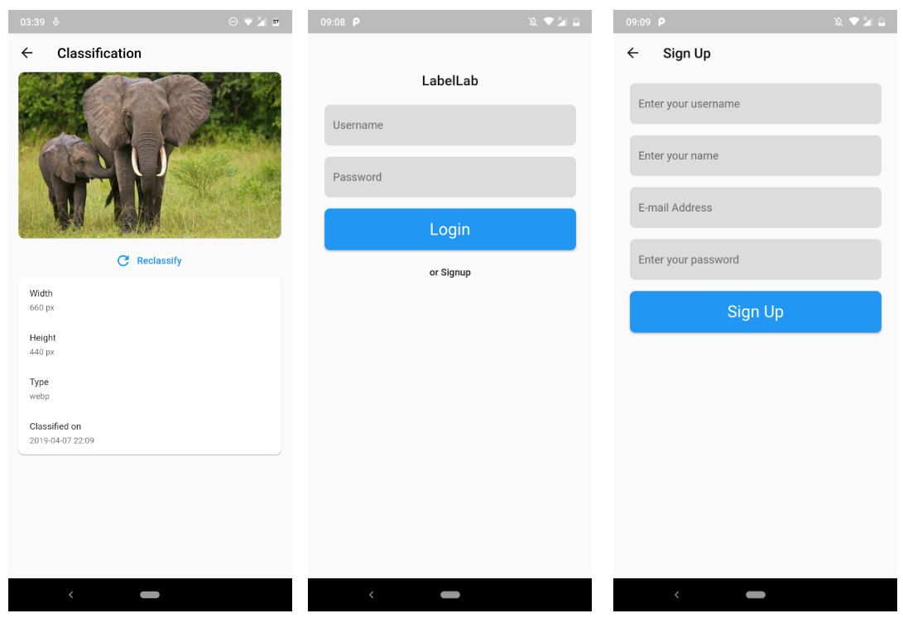

# LabelLab

Machine learning supported web-base image labelling tool for researcher. 

## Getting Started

LabelLab allows objects in images to be labeled using a web based machine learning model.

## Prototype

This is a prototype for LabelLab project. Currenty, this prototype allows an 
image to be uploaded to the backend and receive the size of the image as mock result
to simulate the actual classification model.

Project contains a [mobile](https://github.com/UdeshUK/LabelLab/tree/master/mobile) app which is implemented using Flutter 
framework. And a [backend](https://github.com/UdeshUK/LabelLab/tree/master/backend) implemented with Node.js.

## How To Setup

Please refer the READMEs of individual modules.

## Author

[UdeshUK](http://udeshuk.me)

## License

Please refer [LICENCE](https://github.com/UdeshUK/LabelLab/tree/master/LICENSE)